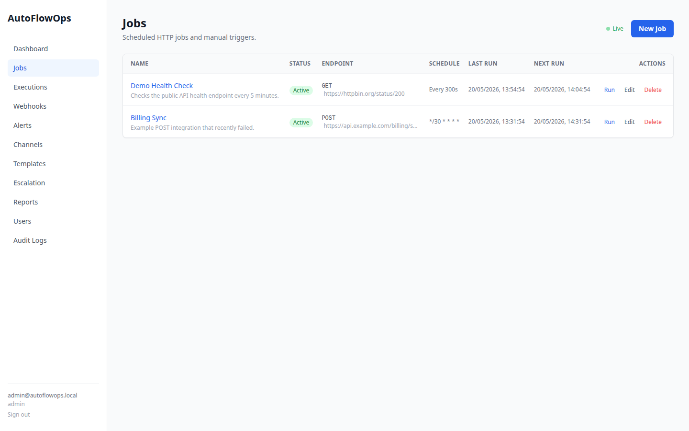
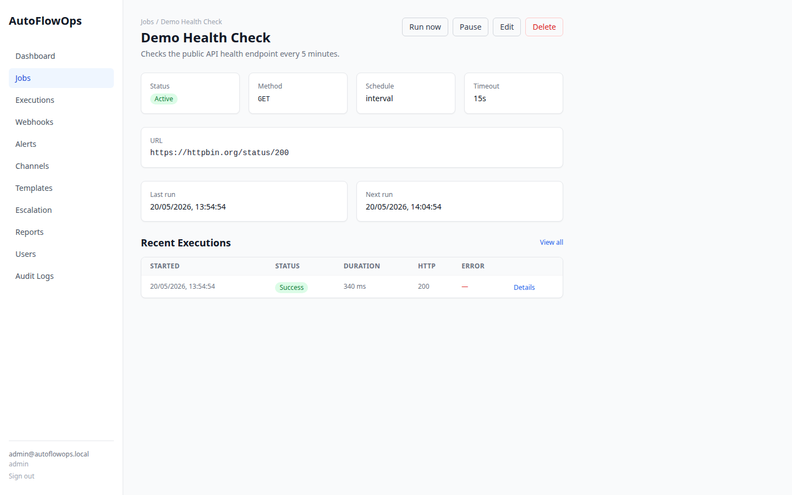
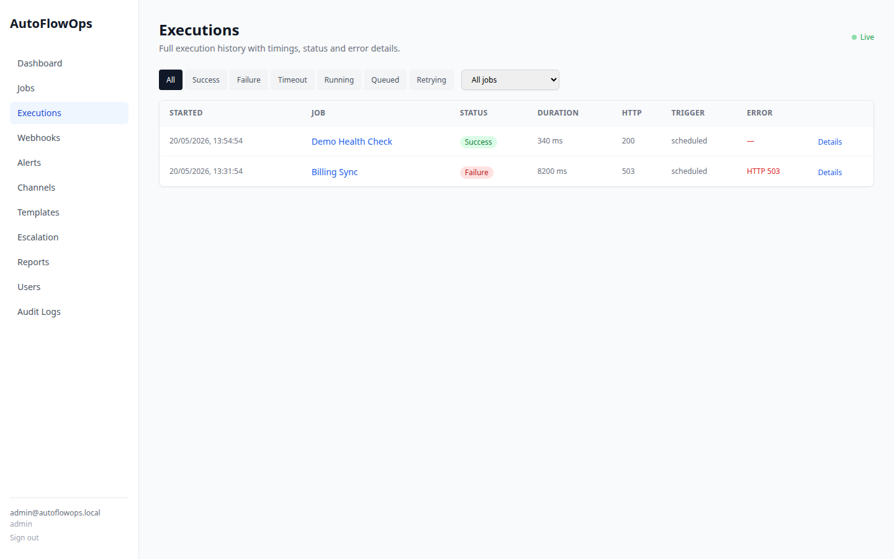
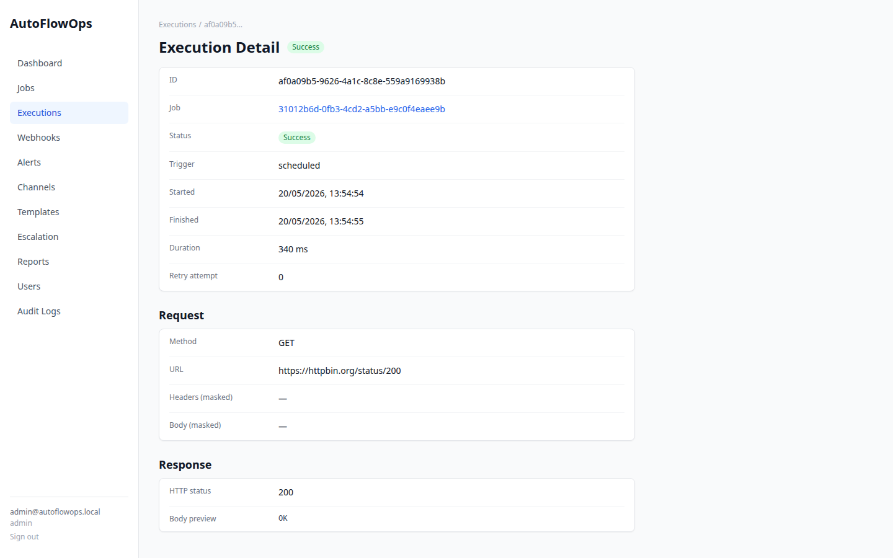
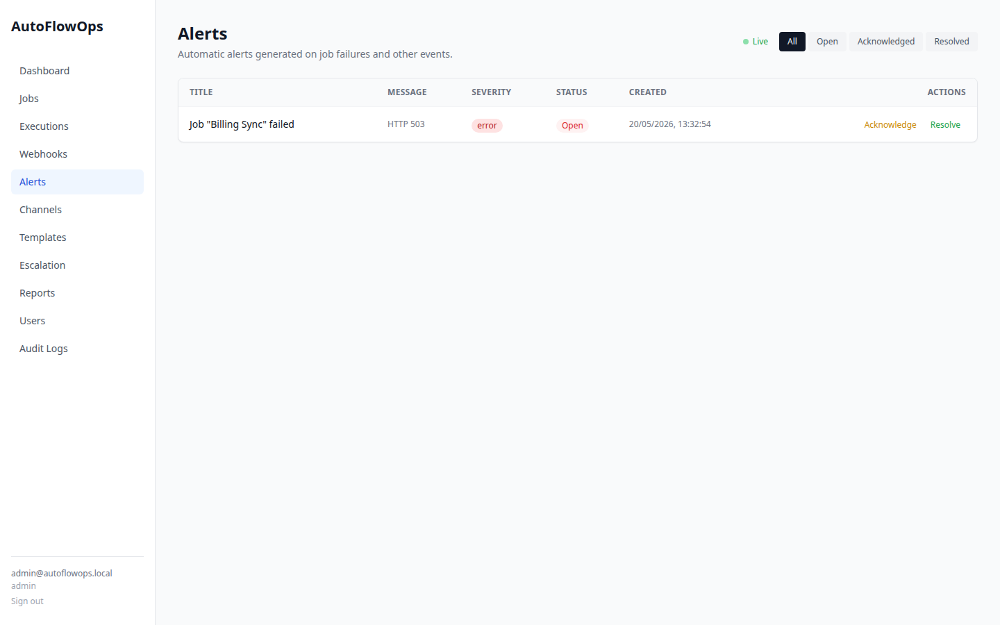
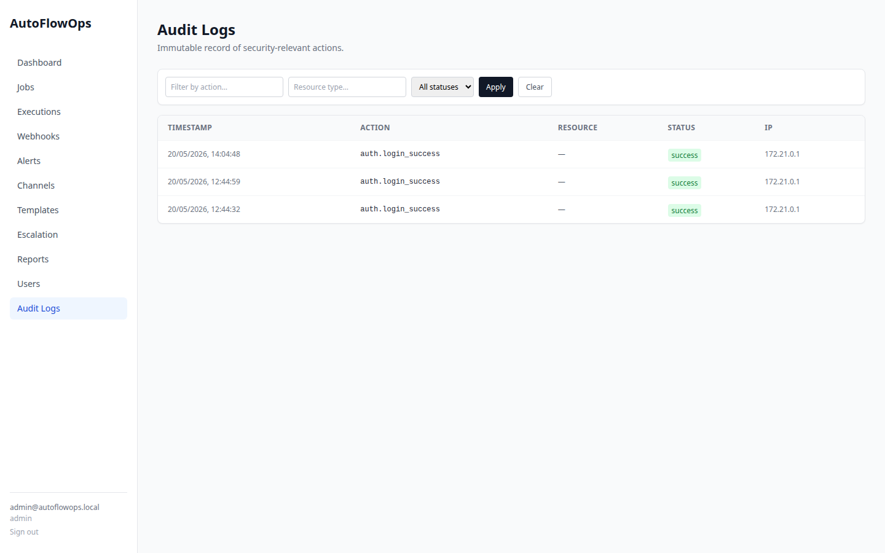
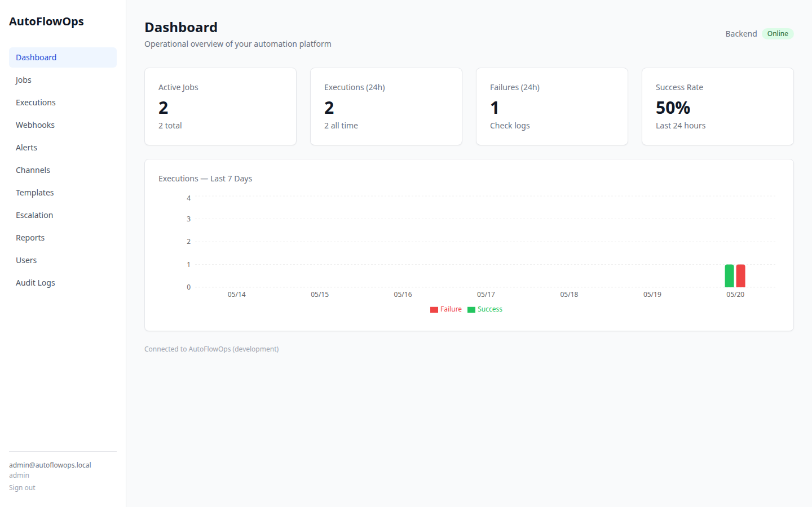
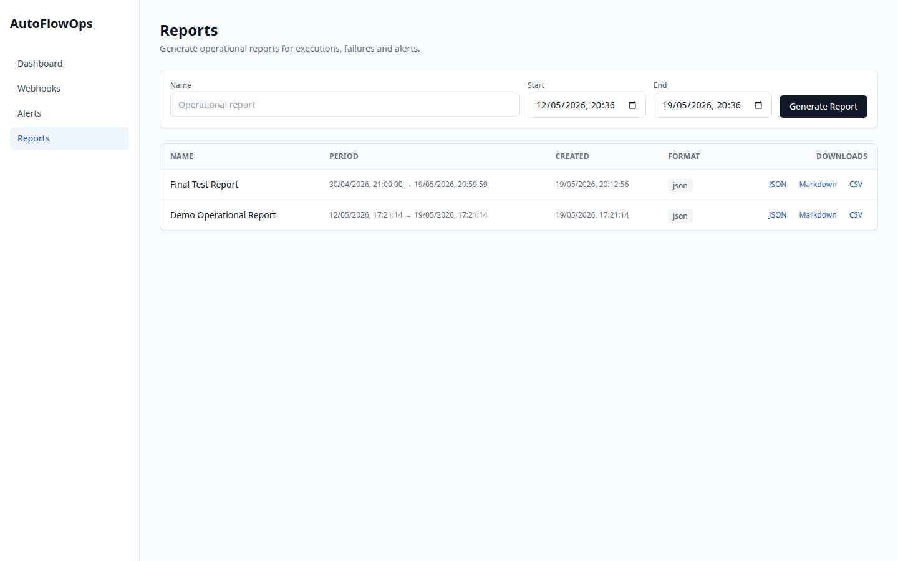

# AutoFlowOps

**Open-source automation platform for scheduled HTTP jobs, API integrations, webhooks, alerts, external notifications and operational reports.**

AutoFlowOps helps developers and small teams replace fragile manual processes with reliable, observable and documented automation workflows — self-hosted, reproducible and fully open source.

[](https://github.com/btcneves/autoflowops/actions/workflows/backend-ci.yml)
[](https://github.com/btcneves/autoflowops/actions/workflows/frontend-ci.yml)
[](LICENSE)

> [Versão em Português (PT-BR)](README.pt-br.md)

---

## The Problem

Teams and developers often have routines scattered across isolated scripts, spreadsheets, improvised automations and paid tools with no visibility:

- Periodic API polling with no execution history
- Webhooks received with no audit trail
- Cron jobs that fail silently
- Manual repetitive tasks with no trace
- Integrations that break with no alert

## The Solution

AutoFlowOps centralises these routines in a single self-hosted platform:

- **Jobs** — create, edit and schedule HTTP jobs from the UI or API; run manually or on interval/cron schedules
- **Executions** — persistent history with status, timings, response previews and masked secrets
- **Webhooks** — receive external events, store payloads with token validation, reprocess events
- **Alerts** — automatic alerts on job and webhook failures, with acknowledge and resolve workflows
- **Notifications** — send critical alerts to Discord, Telegram, SMTP email and custom webhooks
- **Escalation policies** — multi-step escalation with configurable delays per step
- **Roles** — admin, operator and viewer roles enforced server-side; audit trail of all sensitive actions
- **Reports** — export operational history as JSON, Markdown or CSV
- **Dashboard** — real-time metrics: active jobs, executions, failure rate and 7-day chart

---

## Features

- Self-hosted, runs on any server or Docker environment
- REST API backend (FastAPI + PostgreSQL), Celery worker and React frontend
- Scheduled jobs with interval (seconds) and cron expressions
- Redis-backed job queue for manual and scheduled executions
- HTTP job runner with configurable timeout
- Webhook receiver with secret token validation (SHA-256)
- Execution history with masked secrets and response previews
- Internal alerting system for failed executions
- External notification channels for critical operational alerts (Discord, Telegram, SMTP, custom webhooks)
- Notification templates and multi-step escalation policies
- Role-based access control (admin / operator / viewer) enforced server-side
- Audit log of all sensitive operations with actor, resource and masked metadata
- User management API and frontend (admin-only)
- Operational reports exportable as JSON, Markdown or CSV
- Real-time event stream via WebSocket — live updates for executions, jobs and alerts without page refresh
- One-command startup via Docker Compose — build locally or pull versioned images from GHCR
- GitHub Actions CI for backend and frontend; automated Docker image publish on every release tag
- Open-source under MIT License

---

## Stack

| Layer | Technology |
| --- | --- |
| Backend | Python 3.12, FastAPI, Pydantic v2, SQLAlchemy 2.x, Alembic |
| Database | PostgreSQL 16 |
| Scheduler | APScheduler dispatching to Celery |
| Queue / Worker | Redis + Celery |
| HTTP client | httpx |
| Frontend | React 18, TypeScript, Vite, Tailwind CSS |
| State/Fetch | TanStack Query v5 |
| Charts | Recharts |
| Testing | pytest (backend), Vitest + Testing Library (frontend) |
| Lint | ruff (backend), ESLint + Prettier (frontend) |
| DevOps | Docker, Docker Compose, GitHub Actions, GHCR, Makefile |

---

## Architecture Overview

```text
Browser
  └─> React/Vite frontend (port 3000)
        └─> FastAPI REST API (port 8000)
              ├─> SQLAlchemy async session
              │     └─> PostgreSQL (port 5432)
              ├─> APScheduler (in-process)
              │     └─> Redis queue
              │           └─> Celery worker (executes jobs, creates executions + alerts)
              ├─> Webhook receiver (validates token, stores events)
              └─> Notification channels (Discord, SMTP, custom webhooks)
```

For a detailed breakdown of each component and data flow, see [docs/architecture.md](docs/architecture.md).

---

## Screenshots


| &nbsp; | &nbsp; |
| --- | --- |
|  |  |
|  |  |
|  |  |
|  |  |

More: [Login](docs/assets/screenshots/login.png) · [Job Form](docs/assets/screenshots/job-form.png) · [Webhooks](docs/assets/screenshots/webhooks.png) · [Templates](docs/assets/screenshots/notification-templates.png) · [Escalation](docs/assets/screenshots/escalation-policies.png) · [Users](docs/assets/screenshots/users.png) · [API docs](docs/assets/screenshots/api-docs.png)

---

## Quick Start

### Option A — Pull from registry (no build required)

The fastest way to run AutoFlowOps is to pull pre-built images from GitHub Container Registry:

```bash
git clone https://github.com/btcneves/autoflowops.git
cd autoflowops
bash scripts/setup.sh
```

The script asks for an image tag (default `latest`), copies `.env.example` to `.env`, pulls the images and starts the stack. Edit `.env` and change `APP_SECRET_KEY` and `JWT_SECRET_KEY` before any production use.

To run a specific release:

```bash
IMAGE_TAG=v1.0.0 bash scripts/setup.sh
# or
IMAGE_TAG=v1.0.0 make registry-up
```

### Option B — Build from source

### Requirements

- Docker + Docker Compose

### 1. Clone and configure

```bash
git clone https://github.com/btcneves/autoflowops.git
cd autoflowops
cp .env.example .env
```

Edit `.env` and change `APP_SECRET_KEY` and `JWT_SECRET_KEY` before deploying to production.

### 2. Start

```bash
make dev
# or
docker compose up --build
```

| Service | URL |
| --- | --- |
| Frontend | <http://localhost:3000> |
| Backend API | <http://localhost:8000> |
| API docs (Swagger) | <http://localhost:8000/docs> |
| API docs (ReDoc) | <http://localhost:8000/redoc> |
| Redis | `localhost:6379` |

### 3. Verify

```bash
curl http://localhost:8000/api/health
```

Expected:

```json
{"status": "ok", "app": "AutoFlowOps", "env": "development", "database": "ok"}
```

### 4. Seed demo data (optional)

```bash
make seed
```

This creates a set of demo jobs, executions, webhooks and alerts so the dashboard renders with data immediately.

---

## Local Development (without Docker)

### Backend

```bash
cd backend
python -m venv .venv
source .venv/bin/activate
pip install -e ".[dev]"
uvicorn app.main:app --reload
```

### Frontend

```bash
cd frontend
npm install
npm run dev
```

See [docs/development.md](docs/development.md) for the full local development guide, including environment variables and database setup.

---

## Testing

```bash
# Backend
cd backend
PYTHONPATH=. pytest

# Frontend
cd frontend
npm test

# Both (via Makefile)
make test
```

**Current test status:**

| Suite | Tests | Status |
| --- | --- | --- |
| Backend | 216 | Passing |
| Frontend | 75 | Passing |

---

## Lint and Format

```bash
# Backend
cd backend
ruff check .
ruff format .

# Frontend
cd frontend
npm run lint
npm run format

# Both (via Makefile)
make lint
make format
```

---

## Makefile Targets

```bash
make dev           # docker compose up --build (foreground)
make up            # docker compose up -d --build (background)
make down          # docker compose down
make logs          # docker compose logs -f
make worker-logs   # docker compose logs -f worker
make test          # run backend + frontend tests
make lint          # run backend + frontend lint
make format        # run backend + frontend format
make seed          # seed demo data into running Docker containers
make prod-up       # start production stack with Caddy reverse proxy
make prod-down
make prod-logs
make prod-validate
make setup         # copy .env.example to .env
make pull          # pull backend + frontend images from GHCR (IMAGE_TAG=latest)
make registry-up   # start stack using GHCR images (IMAGE_TAG=latest)
make registry-down # stop registry-based stack
make registry-logs # stream logs from registry-based stack
```

---

## Project Structure

```text
autoflowops/
├── backend/         FastAPI application, models, services, tests
├── frontend/        React application, components, pages, tests
├── docs/            Documentation
├── examples/        Usage examples (curl recipes)
├── scripts/         Utility scripts
├── .github/         CI workflows and PR/issue templates
├── docker-compose.yml
├── Makefile
└── .env.example
```

---

## Documentation

| Document | Description |
| --- | --- |
| [Architecture](docs/architecture.md) | Components, data model, scheduling and security model |
| [API Reference](docs/api-reference.md) | All endpoints with request/response examples |
| [Development Guide](docs/development.md) | Local setup, environment variables, project structure |
| [Security](docs/security.md) | Masking policy, webhook tokens, .env best practices |
| [Roadmap](docs/roadmap.md) | Completed features, next steps and future plans |
| [Deployment](docs/deployment.md) | Docker Compose, migrations and production checklist |
| [Screenshots](docs/screenshots.md) | Screenshot index and regeneration instructions |

---

## Roadmap

| Feature | Status |
| --- | --- |
| FastAPI backend + REST API | ✅ Done |
| PostgreSQL + SQLAlchemy + Alembic | ✅ Done |
| HTTP job runner with secret masking | ✅ Done |
| APScheduler (interval + cron) | ✅ Done |
| Dashboard with real metrics + chart | ✅ Done |
| Webhook CRUD + token validation + events | ✅ Done |
| Internal alerts + acknowledge/resolve | ✅ Done |
| Reports (JSON, Markdown, CSV) | ✅ Done |
| Docker Compose + GitHub Actions CI | ✅ Done |
| Jobs management UI | ✅ Done |
| Executions history UI | ✅ Done |
| Authentication (JWT) | ✅ Done |
| SSRF protection for HTTP jobs | ✅ Done |
| Webhook rate limiting | ✅ Done |
| VPS deployment guide | ✅ Done |
| Caddy reverse proxy + production Compose | ✅ Done |
| Production health checks and config CI | ✅ Done |
| Celery + Redis worker | ✅ Done |
| Queued manual and scheduled job execution | ✅ Done |
| External notifications (Discord, Telegram, email) | ✅ Done |
| Notification templates + escalation policies | ✅ Done |
| RBAC (role-based access control) | ✅ Done |
| Audit log with actor and masked metadata | ✅ Done |
| User management API and frontend | ✅ Done |
| Real-time event stream via WebSocket | ✅ Done |
| Docker image registry (GHCR) + setup script | ✅ Done |
| Advanced retry policy UI | ✅ Done |

See [docs/roadmap.md](docs/roadmap.md) for the full roadmap.

---

## Security

- Secrets are masked in all logs and stored execution records
- Webhook tokens are stored as SHA-256 hashes, never in plain text
- `.env` is never version-controlled; only `.env.example` is committed
- JWT authentication required; bootstrap admin credentials set via `ADMIN_EMAIL` / `ADMIN_PASSWORD` env vars — change them before deploying
- Role-based access control (admin / operator / viewer) enforced on every write endpoint
- Audit log records all sensitive operations atomically with actor, IP address and masked metadata
- SSRF protection blocks job URLs targeting private/internal ranges by default
- Notification channel credentials encrypted at rest (Fernet AES)

See [SECURITY.md](SECURITY.md) for the vulnerability reporting policy and full masking rules.

---

## Contributing

Contributions are welcome. Please read [CONTRIBUTING.md](CONTRIBUTING.md) before opening a pull request.

For security vulnerabilities, follow [SECURITY.md](SECURITY.md) — do not open public issues.

---

## License

[MIT](LICENSE) © 2026 AutoFlowOps Contributors
